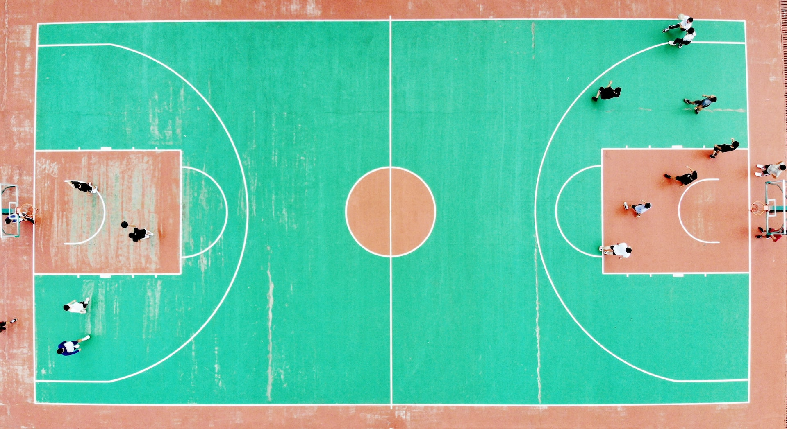
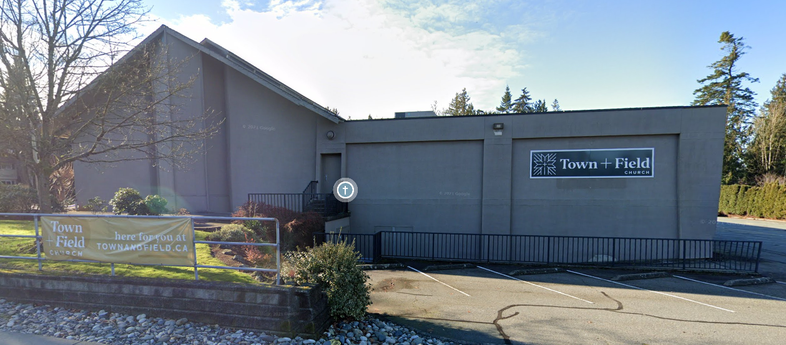

## **Langley Men's Pick-Up Basketball**

## **Next Run**

Tuesday or Thursday this week

 <a href="#interested">Click here to get on the list.</a>

## **Overview**

* Fun, friendly, competitive play.
* Open to players throughout the Fraser Valley.
* Tuesdays and Thursday mornings at 6:30am.

**Experience playing basketball is necessary.**

## **Location**

Games graciously hosted by [Town and Field Church](https://townandfield.ca/) located at [20719 48 Avenue, Langley, BC, V3A 3L7](https://goo.gl/maps/283R8xNWTGZxmEnH8).

The program is organized by [Holy Nativity Orthodox Church](https://www.holynativitychurch.ca/).

## **Time**

* Every **Tuesday** and **Thursday** morning
* 6:30am - 8am
* We'll text the day before to confirm that there are enough players

## **Cost**

* Entry is by donation as you are able. Everyone is welcome regardless of your ability to donate a specific amount.
* Suggested donation amount is $5 per session.
* We don't collect any money.
* Participants donate directly to one of Town and Field's local ministry partners:
  *  [Nightshift](https://nightshiftministries.org/donate/)
  *  [Hope for Women](https://www.hopeforwomen.ca/?form=FUNUCMFYHQY)
  *  [Burnaby Counselling Group](https://counsellinggroup.org/donate/)
* Consider giving over above the suggested amounts if you are able since these are good causes and it is a way of thanking Town and Field for their hospitality. Also it covers the giving for players who aren’t able to donate the suggested amount.

**IMPORTANT:** Donations are on the honour system! You are responsible to donate in accordance with how often you play ball.

<h2 id="interested"><strong>Interested?</strong></h2>

* Text/call Scott at 604.700.4426 to get on the interested player list.
* When we text for confirmation, respond with whether you plan to come the following day.
* Play ball!

 

 

   

